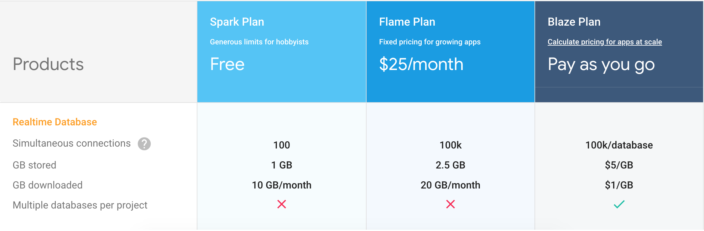

# Intro to Vue + Firebase

---

## What are we talking about

* What is Firebase and why use it
* Integrating it into an app

---

## What is Firebase?

"Firebase" is actually use to mean two things:

* a suite of tools owned by Google, including auth, storage, hosting, etc
* their Realtime Database product in particular.

---

## Suite of tools, you say?

* Realtime Database
* Firestore (even better RT DB, in Beta, we'll talk later)
* Cloud Functions (Think Lambdas)
* Storage (think S3)
* Hosting
* Auth
* ML Kit

---

## Why Firebase (the db)

Realtime Database makes it trivial to sync your app state to a database, **and your database across clients**.

No networking code to write, no exceptions to handle; that's Google's job.

---

## Limits

* 100,000 simultaneous connections
* 100,000/s simulatenous responses sent from a single db
* 1000 cloud functions triggered by a single write (more on this later)

---

## Pricing



---

## Let's do some things!

Step 1: start a project in the dash.

---

---?image=img/project.png&size=auto 70%

---?image=img/rtdb.png&size=auto 70%

---?image=img/config.png&size=auto 70%

---?image=img/rules.png&size=auto 70%

---

Don't think too hard about the bad security we just set up, we'll come back to it.

---

## Let's do some things!

Step 2: Start a basic vue project

We'll use the webpack-simple template for basic webpack config with vue-loader.  (This gives us single-file components.)

---?image=img/init.png&size=auto 85%

---

## Now the dangerous part: live code.

---

## The Giving Tree, aka NoSQL modeling

Everything is exactly one big JSON tree

It's `ref`s, `child`s, `key`s and `value`s all the way down (up to 32 levels deep)

Each of these can be a `ref`:

* db.ref("blog");
* db.ref("blog/posts");
* db.ref("blog/posts/fiuhuiphagiuhfg");

---

## Paint with ~all the colors of the wind~ these colors:

* ref.set = assign this object to this ref. (Like PUT)
* ref.update = overwrite these attributes at this ref. (Like PATCH)
* ref.remove = delete this ref
* ref.push = make a new key and assign these attributes to that key as a child of ref.

(Keys are timestamp-related, so ordering is maintained.)

## Pop quiz: what will the db look like after these actions?

```vue
  testRef.child('test').set({
    name: 'ben'
  })
  testRef.child('test').child('testagain').set({
    name: 'ben2'
  })
  testRef.child('test').child('testagain').push({
    name: 'ben3'
  })
```

---?image=img/answer.png&size=auto 100%
